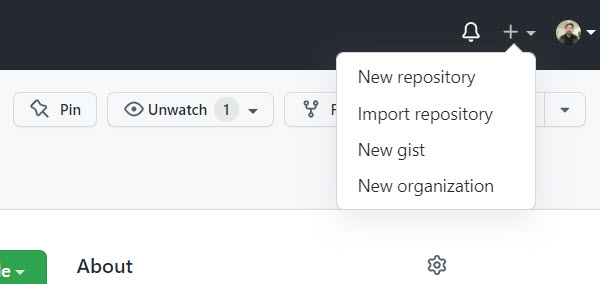
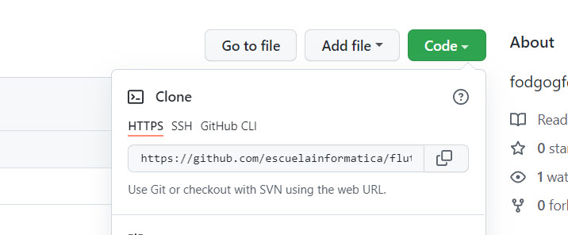
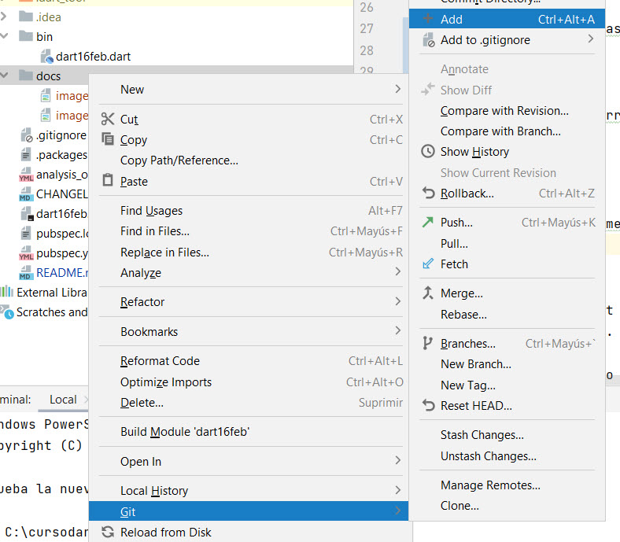
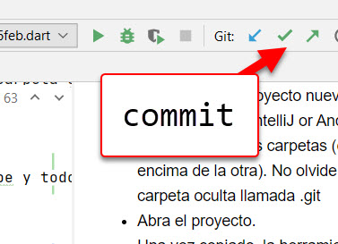

# flutter16feb2022
fodgogfdofgdofgdo

* En github (pagina web, crear un repositorio nuevo), indicando los permisos y si se quiere un archivo readme.md (este archivo)




* luego, copiar el vinculo del github, ejemplo: https://github.com/escuelainformatica/flutter16feb2022.git



* abrir la linea de comando (cmd, shell, etc.)

* buscar una carpeta donde descargar el archivo

* y escriba:

ps: no olvide instalar el programa git.

```shell
git clone https://github.com/escuelainformatica/flutter16feb2022.git
```

* luego, cree un proyecto nuevo en otra carpeta usando IntelliJ or Android Studio.

* Y combine ambas carpetas (copie una encima de la otra). No olvide incluir la carpeta oculta llamada .git

* Abra el proyecto.

* Una vez copiado, la herramienta va a entender que hay un repositorio en la nube y todo lo demas se puede hacer 
directamente en el IDE

* para subir cambios

1) agregar o quitar documentos al git.



2) luego, hacer un commit (y agregar un comentario)



3) y finalmente hacer un push.

Ya sea con el icono (al lado del boton de commit) o mediante la linea de comando:

```shell
git push
```

Si quiero hacer el camino contrario, se hace un pull (update project) para actualizar los cambios.

